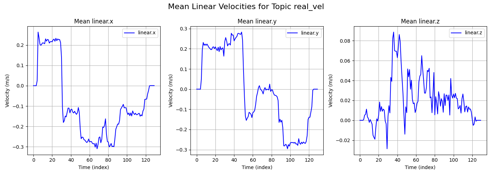
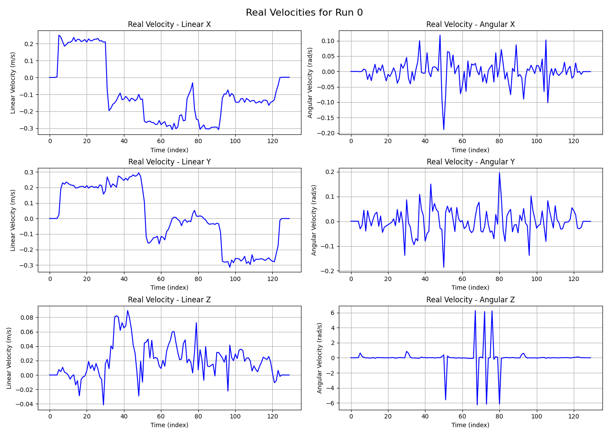
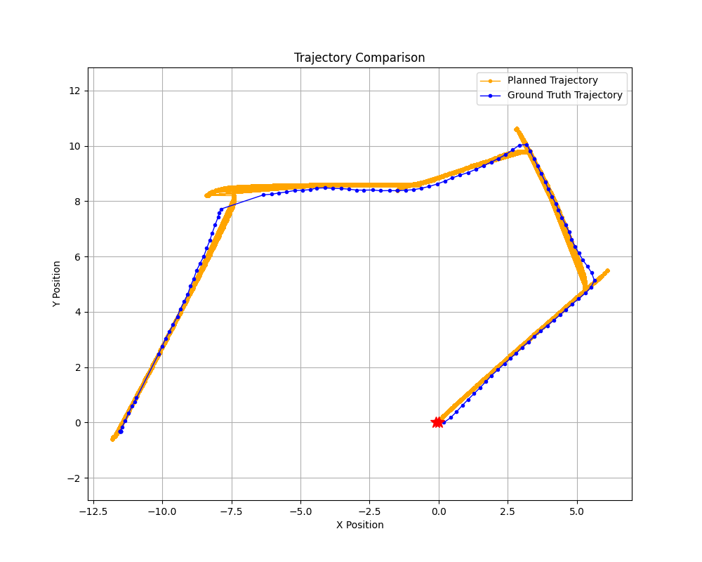

# Data Analysis for Robotics Simulations

This repository contains a set of scripts and utilities to process and analyze ROS bag files. It converts ROS bags into CSV format, organizes data per topic, generates plots for velocities and trajectories, and computes errors for analysis.

<p align="center">
  
  
  
</p>

## Table of Contents

- [Overview](#data-analysis-for-robotics-simulations)
- [Dependencies](#dependencies)
- [Folder Structure Created by Script](#folder-structure-created-by-script)
- [User Manual](#user-manual)
  - [Setup](#setup)
  - [Execution Flow](#execution-flow)
- [Errors and Plots](#errors-and-plots)
- [Available Functions](#available-functions)
  - [Setup & Data Preparation](#setup--data-preparation)
  - [Plotting](#plotting)
  - [Error Computation](#error-computation)
- [Notes and Warnings](#notes-and-warnings)

## Dependencies

- `bagpy`
- `pandas`
- `matplotlib`
- `pyyaml`
- `numpy`
- `scikit-learn`

Install dependencies with:

```
pip install bagpy pandas matplotlib pyyaml numpy scikit-learn
```


## Folder Structure Created by Script

Upon running the script, the following structure is created within your specified `bag_folder`:

- **csv_files/**
  - **per_run/**
    - **run_0/** (individual run CSV files)
    - **run_1/**
    - ... and so on.
  - **per_topic/**
    - **topic_name_1/**
    - **topic_name_2/**
    - ... and so on.

- **plots/**
  - Velocity and trajectory plots generated from CSV files.

- **errors/**
  - CSV files containing computed position and velocity errors for each run.

## User Manual

### Setup

1.  Place your ROS bag files (`run_X.bag`) inside a folder (`bag_folder`).
2. Prepare your configuration file (`config.yaml`) according to your ROS topics.

Example `config.yaml` structure:

```
topics:
  real_velocity:
    name: "/real_vel"
    csv_file: "real_vel.csv"
    type: "geometry_msgs/Twist"
  controller_velocity:
    name: "/planned_vel"
    csv_file: "planned_vel.csv"
    type: "geometry_msgs/Twist"
  trajectory_plan:
    name: "/trajectory_plan"
    csv_file: "trajectory_plan.csv"
    type: "nav_msgs/Path"
```

### Execution Flow
The script must be executed in the following order in `main()`:

1. **load_config**
2. **convert_bags_to_csv**
3. **organize_csv_per_topic**
4. **plot_velocities_for_all_runs** *(optional plotting)*
5. **plot_velocities_for_single_run** *(optional plotting)*
6. **plot_mean_velocity** *(optional plotting)*
7. **plot_single_trajectory_or_comparison** *(optional plotting)*
8. **calculate_and_save_all_errors**

## Errors and Plots

This library generates visualizations and numerical evaluations of your robot's performance by comparing ground-truth data with planned or estimated trajectories and velocities.

### Error Metrics

Errors are calculated along three axes — X, Y, and Z — using the following metrics:

- **RMSE (Root Mean Square Error)**  
  Measures the standard deviation of the differences between predicted and actual values. A lower RMSE indicates better performance.

- **Mean Absolute Error (MAE)**  
  The average magnitude of errors in each axis, giving a direct sense of how far off the values are on average.

- **Max Absolute Error**  
  The single largest deviation observed for each axis, useful for identifying worst-case behavior.

The following types of errors are computed:

- **Position Error:**  
  Compares estimated robot positions against ground-truth (e.g., from localization vs. odometry).

- **Yaw Error (Orientation):**  
  Specifically compares the X component of quaternion orientation to assess heading error.

- **Velocity Error:**  
  Compares commanded (planned/controller) velocities against the actual executed velocities (real velocity).

All errors are saved as CSV files in the `errors/` directory and aggregated for all specified runs.

---

### Plot Outputs

Plots are automatically generated from CSV data and saved in the `plots/` folder. These help visually assess the system's behavior and compare it to expectations.

- **Velocity Plots (Per Run and All Runs):**
  - Real and planned linear and angular velocities are plotted over time.
  - Helps visualize tracking accuracy and controller behavior.

- **Mean Velocity Plot (Across Runs):**
  - Aggregates multiple runs and plots the average velocity over time.
  - Useful to observe overall controller consistency.

- **Trajectory Plots:**
  - 2D trajectory visualization (X vs. Y) of both real and planned paths.
  - Optional offset to origin for alignment and easier visual comparison.
  - Waypoints (if provided) are plotted as reference markers.

Each plot is saved as a PNG image and named accordingly (e.g., `real_velocities_run_0.png`, `trajectory_comparison_run_1.png`, etc.).


## Available Functions

Below is a summary of the core functions provided by this library. These functions are designed to streamline the process of working with ROS bag files, organizing data, plotting results, and evaluating performance metrics.

---

### Setup & Data Preparation

- **`load_config(config_path)`**  
  Loads the YAML configuration file with topic names and types.  
  **Usage:**  
  ```python
  topics = load_config("path/to/config.yaml")
  ```

- **`convert_bags_to_csv(bag_folder, num_bags, topics)`**  
  Converts `.bag` files into CSV format. Creates `csv_files/per_run` with separated CSVs per run.  
  **Usage:**  
  ```python
  convert_bags_to_csv("path/to/bag_folder", 2, topics)
  ```

- **`organize_csv_per_topic(bag_folder, num_bags, topics)`**  
  Organizes CSVs into folders per topic for downstream processing.  
  **Usage:**  
  ```python
  organize_csv_per_topic("path/to/bag_folder", 2, topics)
  ```

- **`extract_poses_from_csv(input_csv, output_csv)`**  
  Parses pose data from complex CSVs (e.g., trajectory plans) and rewrites them into structured format.  

- **`parse_pose_block(pose_block)`**  
  Helper to extract position and orientation from raw YAML-style blocks.


### Plotting

- **`plot_velocities_for_all_runs(bag_folder, num_bags, topics)`**  
  Plots both real and planned velocity (linear and angular) across all runs.

- **`plot_velocities_for_single_run(bag_folder, run_id, topics)`**  
  Generates a full 6-axis plot for both real and planned velocity for a single run.

- **`plot_mean_velocity(bag_folder, run_ids, topic_name, topics)`**  
  Computes and plots mean linear/angular velocity over multiple runs.

- **`plot_single_trajectory_or_comparison(...)`**  
  Plots real/planned trajectories for one run. Can offset to origin and show both or either.  

- **`plot_linear_velocities(folder_path, file_names, output_file)`**  
  Internal: Plots linear velocity curves across runs and saves to disk.

- **`plot_angular_velocities(folder_path, file_names, output_file)`**  
  Internal: Same as above, but for angular velocity.

- **`plot_trajectory(csv_path, ...)`**  
  Low-level helper to plot X-Y trajectory from a CSV.

- **`plot_waypoints(csv_path)`**  
  Parses a list of waypoints and plots them as `X` marks.


### Error Computation

- **`calculate_and_save_all_errors(bag_folder, run_ids, topics, ...)`**  
  Master function to calculate position, yaw, and velocity errors for multiple runs. Saves results to CSV.  

- **`calculate_position_errors(bag_folder, run_id, topics, ...)`**  
  Calculates RMSE and absolute errors for estimated vs. ground-truth position and yaw.

- **`calculate_velocity_errors(bag_folder, run_id, topics)`**  
  Compares real vs. controller velocity using interpolated timestamps and computes errors.

- **`save_errors_to_csv(errors_dict, bag_folder, run_id, label)`**  
  Saves error dict to a structured CSV inside the `errors/` folder.

- **`compute_rmse_per_axis(gt_df, est_df)`**  
  Computes RMSE per axis.

- **`compute_absolute_errors_per_axis(gt_df, est_df)`**  
  Computes per-sample absolute errors per axis.

- **`extract_position_columns(df, label)`**  
  Extracts position columns from multiple possible naming schemes.

- **`extract_orientation_x_column(df, label)`**  
  Extracts yaw (orientation.x) from various formats.

- **`load_and_subsample(estimated_df, ground_truth_df)`**  
  Downsamples larger dataframe to match smaller one for fair comparison.

- **`interpolate_to_match(reference_df, target_df, columns)`**  
  Interpolates target to match reference timestamps (used for velocity comparison).

## Notes and Warnings

- CSV file naming and topic definitions in your configuration file must match exactly, so please do not move or rename any folder or file.
- Some functions issue warnings if expected data or CSV files are missing or incorrectly formatted.

---
